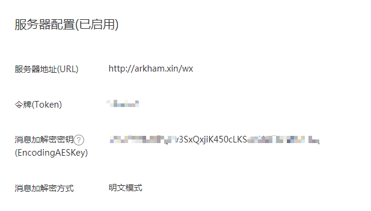

# 网络技术课程项目报告

    

------

**小组成员**

|  姓名  |     学号     |   学院   |   专业   |
| :--: | :--------: | :----: | :----: |
|  武鑫  | 315010xxxx | 机械工程学院 | 机械电子工程 |
| 谭宗洋  | 315010xxxx | 机械工程学院 | 机械电子工程 |

------

**项目介绍**

​	“微信公众平台开发计划”是我们选择的*网络技术*课程大作业项目。微信公众平台，俗称微信公众号，依托社交App微信带来的强大流量，已经成为目前中国主流自媒体平台之一。微信公众号分服务号和订阅号，其中服务号的运营主要面向企业，而订阅号主要由媒体和个人维护。未经开发的公众号只能在微信官方提供的基础功能范围内使用，例如群发推文、群发消息等，这样就损失了很多灵活性。幸运的是，官方为公众平台提供了开发者模式，有一定技术能力的开发者可以自己动手，构建更加丰富的交互功能。下面的图片列举了一部分官方提供的接口权限。

    

​	我们的大作业项目便是构建一个经过完善开发的微信公众号，可以实现多种类型的端到端（服务器-用户）交互，提供比公众号默认功能更加丰富的使用选项，并将其投入实际应用场景。

------

**项目结构**

- 网络架构

    

  - 服务器使用阿里云服务器。
  - Nginx 监听 80 端口消息，对一般的网络请求直接进行处理；遇到呼叫 domain/apache 的请求，进行反向代理，将消息转给8080端口的 Apache服务器；遇到呼叫 domain/wx 的公众号相关请求，进行反向代理，将消息转到 5000 端口，由 WeRoBot 处理。
  - 采用此种架构的历史原因在下文**填坑记录**部分有详细说明。

- 文件结构

    

  - 主目录是 */var/www/wx/*，主目录下存放的 myWeChat.py 是项目主要源文件，myWeChat.log 是源代码错误信息记录，werobot_session.sqlite3 是 SQLite 数据库文件。
  - myWeChat.py 调用 *mods_available/*  下实现好的各个模块，实现微信公众号的所有功能。
  - *pic/*、*music/* 是与某些模块相关的文件夹目录，这些目录下存放与模块功能相关的文件。

------

**主要配置**

- 微信端

  ​	个人用户能够申请的公众号类型只有个人订阅号，个人订阅号相比企业服务号，一部分功能被限制，例如订阅号不能够获取用户地理位置。我们在这些有限的功能支持上进行进一步开发。

  ​	在浏览器进入公众号后台，如下图启用并设置好服务器配置相关参数，就完成了微信端的配置工作。

    

- 服务器端

  - Apache

    将相关配置文件中端口号默认配置（80端口）改为8080端口，其它配置保持不变。

    配置文件包括：

    ​	`/etc/apache2/ports.conf`

    ​	`/etc/apache2/sites-available/000-default.conf`

  - Nginx

    设置监听端口以及反向代理的规则。

    配置文件：

    ​	`/usr/local/nginx/conf/nginx.conf`

  - Supervisor

    作用是守护`werobot.run`进程，使其一直保持在运行状态，以免关掉终端之后进程随之关闭。

    配置文件：

    ​	`/etc/supervisord.conf`

    supervisorctl 和 supervisord 命令：

    使用 Supervisor 的另一个好处是它可以非常方便地开启/关闭/重启特定受管理的进程，实际经验表明，这大大提高了调试公众号服务器的效率。

  另外，为了保证以上三种服务能随服务器开机启动，需要在 */etc/init.d/* 目录下添加对应的自启动文件。

  自启动文件有：

  ​	`/etc/init.d/apache2`

  ​	`/etc/init.d/nginx`

  ​	`/etc/init.d/supervisord`

  所有的配置文件都已备份至附件的源代码文件夹中，并且已在有修改的区域做好了标注。

------

**模块说明**

​	在研究 Apache 源码的那两天里，从它的组织结构中受到启发，对公众号支持的功能进行模块化设计，存放在根目录下的 *mods_available/* 文件夹内。这样可以提高代码组织的条理性，并便于管理。

​	项目主体采用 Python 编写，且符合PEP8标准。另外，为了进一步锻炼自己的编程能力，所有模块均采用面向对象风格编程，每一个模块是一个类。

- 天气预报

    用户上传自己的地理位置，公众号返回该地的当前天气及近期几日的天气情况。	当然用户也可以发送其它位置信息，这样返回的的就会是任意地点的天气信息。

    ​	*注：目前天气模块仅对中华人民共和国境内地理位置有效*

    技术栈：

    - ip地址-->行政区划------------------[百度地图开放平台 API](http://lbsyun.baidu.com/)
    - 某地天气预报------------------------[JSON在线开放 API](www.sojson.com)

- 即时翻译

  根据用户的需求，实时进行多种语言之间的相互翻译。	

  使用方法：

  - `翻译 xxx`

    xxx 为除中文外任意语言，将该语言翻译为中文；xxx 为中文，翻译结果为英文。

  - `翻译 A到B xxx`

    A 和 B 是翻译功能支持的翻译语种，通过指定 A 与 B ，可以实现特定要求的翻译。

    *注1：“翻译”、“A到B”、“xxx”区块之间的空格不是必须的，服务器处理请求时区块间的所有空格都会被除去*

    *注2：支持语言类型有中文、日文、英文、韩文、法文、俄文、葡文、西文*

  技术栈：

  - 语种翻译------------------------------[有道智云API](http://ai.youdao.com/)

- 营养查询

  查询食物的主要营养成分。	

  由于没有现成的 API 供调用，所以选择爬取[薄荷网](http://www.boohee.com/)的营养成分数据。

  技术栈：

  - 营养成分获得-------------------------Python爬虫

- 往事

  查询历史上的今天。	

  由于没有现成的 API供调用，所以选择爬取[历史上的今天](http://www.lssdjt.com/)网站的数据。

  尝试在文本中添加超链接时，出现很多意想不到的问题，详见**填坑记录**。

  技术栈：

  - 历史事件获取-------------------------Python爬虫

- 看图识人

  用户发送包含人脸的图片给公众号，公众号就可以回复针对人脸的评价，如年龄、情绪、颜值等。	

  ​	*注：图片中包含多个人脸时，将会按顺序分别给出对应评价*

  技术栈：

  - 人脸信息识别-------------------------[Face++ 旷世人工智能开放平台 API](http://www.lssdjt.com/)
  - 图片储存-------------------------------爬虫图片下载
  - 图片传输-------------------------------POST请求

- 音乐

  用户发起音乐请求，公众号随机提供曲库内一首歌。曲库是事先建好的，其中收藏了固定数量的音乐。 

  曲库的建立借助了 Apache 服务器下的网站结构，使得通过网页访问能够访问到这些歌曲。服务器随机选择并返回一首歌的网址给微信服务器，微信服务器便可以将歌曲推送给用户。

  ​	*注1：只要发送信息的前两个字为“音乐”，便可以发起音乐请求，不管后面有没有包含其它内容*

  ​	*注2：语音消息在处理的时候会首先转换为文字，其余与文字消息相同。在其它模块下语音转文字的处理方式同样适用*

  技术栈：

  - 曲库-------------------------------------Apache Web 服务

- 传书

  提供了一种用户和管理员沟通的机制。用户通过传书功能，可以将想要说的话发送给公众号管理员的个人邮箱管理员就可以及时获取用户的反馈。  

  该功能为每位用户设置了一小时的冷却时间，从而避免了垃圾邮件攻击。

  因为STMP建立连接的过程中可能会消耗太多时间，所以将其安排为一个子线程单独运行，这样便不会超过主程序的处理时间限制。

  技术栈：

  - 邮件传输-------------------------------SMTP应用、多线程
  - 冷却时间设置-------------------------数据库记录时间戳

- 其它功能

  除了上述模块所提供的功能，还有一些规模比较小的功能，它们有的被直接写在了主程序中，有的被简单存放在模块文件夹中。

  - 关注消息

    新增关注者时，自动向其发送一条欢迎消息。

  - 语音处理

    收到语音信息时，通过微信服务器提供的语音处理功能将其转化为文字，然后按照文字处理的规则去处理。

  - 念诗模块

    当收到的消息不属于上述功能可处理的类型时，系统调用念诗模块，即在本地的诗词库中随机调用一句诗，返回给用户。更新后的念诗模块在诗词之外，增加了功能提示，引导用户去尝试上述各个功能。

  - 取关提示

    当有用户取消关注时，自动发送一封电子邮件给管理员，注明是谁在什么时间取消了关注。

------

**填坑记录**

- 在决定做微信公众号开发之前，服务器上已经搭建了一个 Apache 网站。网站访问显然需要占用80端口，而微信公众平台开发者文档也明确声明了只接受80端口的配置，如何使二者共存是一个问题。最初尝试了直接在主目录下面添加一个 */wx* 文件夹，在里面实现公众号相关服务，但是这样似乎与原有的网站有冲突，导致微信服务器一直无法接受正确的信息。研究了两天 Apache 的配置代码，最后选择放弃。上网查找解决方案之后，选择尝试 Nginx 的反向代理功能，将与公众号有关的请求反向代理到另一个端口，同时在 WeRoBot 源文件中规定好监听这个被反向代理的端口。在配置过程中，发现 Nginx 本身可以作为一个 Web 服务器，这样与 Apache 的功能又产生冲突，比如访问网站主页的时候，有时会访问到 Apache 主页，有时会访问到 Nginx主页。选择将 Apache 的监听端口也做一个修改，将80端口让给 Nginx 。于是一般情况下网站页面由 Nginx 来负责，通过访问 *domain/apache* 触发反向代理，实现访问 Apache 服务器。最终形成上文项目结构中所展示的那种网络拓扑结构。

- 阿里云服务器防护机制的存在使得网络应用设置较为繁琐，如果需要使用自定义端口，必须先在阿里云后台设置该端口为开，否则默认都是关闭。

- supervisor 只能由 Python2.X 来运行，但是它可以管理 Python3.X 的程序。

- 往事模块中，在消息中加入带有超链接的文本后，会有很大概率触发消息发送失败，但是在服务器端查看并没有发现错误，所以最可能的情况是腾讯机制的问题，网上论坛中的讨论也暗示微信的超链接文本发送并不稳定。 

  经测试发现，不改变模块代码，会出现服务有时故障、有时正常的情况，比如今天出故障，明天再试一试却可以正常运行。推测故障与否可能与文本消息的内容（可能含有敏感词）有关。另外，同样的文本，加上超链接会出故障，去掉超链接便可以正常发送，推测可能是官方对含超链接文本的审查力度比一般文本更大。还发现的一个影响文本能否成功发送的因素是超链接数量与文本行数的关系，比如加了一个超链接的文本，发送二十行以内是不会出故障的，加上两个超链接就会出错。而且超链接数量与最大允许发送的文本行数也不是线性的。综上各个原因，目前暂时在回复中取消超链接，只发送纯文本信息。但是，纯文本信息如果太长，还是有可能触发故障信息。<del>所以这个问题目前暂时没有解决办法。</del>**该问题已解决**，往事模块最后改为返回一张图片：
  

    

- 不要随便在域名后面加“/”符号，虽然浏览器中加上也可以正常访问，但是在请求 API 时可能会造成解析错误

- 微信服务器规定从请求发送到服务器响应必须在5秒以内，不然就会认为服务器故障，因此各个功能必须保证在5秒之内能够返回结果。

------

**未来方向**

- 用 Flask 框架代替 WeRoBot 连接 Nginx ，然后将 WeRoBot 连接至 Flask ，以提升微信服务器的稳健性
- 天气模块实现对全球任意位置天气预报的支持（获取国际天气预报，可能需要科学上网）
- 股票、基金、期货信息查询，区块链交易实时查询（需要科学上网）
- 可利用百度地图开放API支持的其它功能搭建更多应用，如路线规划、附近热点（商场、饭店等）
- 图片功能，为用户随机推送感兴趣的图片
- 利用 Apache Web 搭建短链接服务，用户提供任意网址，能返回一个长度很短的短链接
- 利用阿里云服务器搭建云存储功能，可接收/获取大小限定在一定范围的文件
- 掌握深度学习之后利用深度学习框架搭建智能聊天机器人（替代念诗模块），用到深度学习领域的自然语言处理
- 聊天机器人培养计划，机器人随着与人类聊天记录的累计，逐渐学会各种场景的对话，并带上用户聊天习惯中的一些个人印记，如一些用户聊天时喜欢在一句话的结尾加上“嘛”，那么他培养出来的机器人也会拥有这个习惯。本功能依然基于深度学习的自然语言处理
- 名著聊天机器人，以名著的语料作为训练基础，培养出语言风格与给定文学作品类似的聊天机器人
- 利用深度学习自然语言处理实现智能定位用户需求，用户发起请求不再需要在一句话开头标记好请求类型，机器人可以智能识别用户的需求。如用户可以直接发送“把xxx给我翻译一下”，机器人就可以得知是需要调用翻译模块

------

**参考资料**

- [微信公众号功能开发举例——博客园](http://www.cnblogs.com/mchina/tag/%E5%BE%AE%E4%BF%A1%E5%85%AC%E4%BC%97/)
- [利用阿里云 ECS 搭建微信公众平台服务器——简书](https://www.jianshu.com/p/e22d152fae9a)
- [Nginx 中文文档](http://www.nginx.cn/doc/)
- [Ubuntu Nginx 开机自启动——W君——博客园](http://www.cnblogs.com/wkun/p/3798816.html)
- [免费天气API，全国天气 JSON API接口，可以获取五天的天气预报——技术博客](http://www.sojson.com/blog/234.html)
- [Supervisor: A Process Control System——Supervisor 3.3.3 document](http://www.supervisord.org/)
